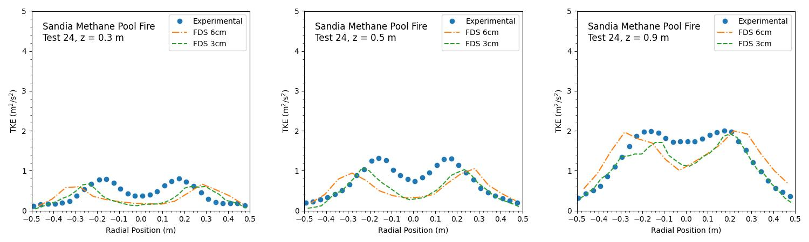

## Validation of the Sandia Methane Pool Fire Case
This study focuses on the effect of varying grid resolution on the plume profile as well as the comparison of turbulent kinetic energy profiles from simulations against experimental data. Case files are obtained from the FDS repository and found in the Setup/ folder. Experimental data for turbulent kinetic energy is taken from [1].

### Plume Profiles

### Turbulent Kinetic Energy Comparisons

[1] K. Mcgrattan et al. "Fire Dynamics Simulator Technical Reference Guide Volume 3: Validation". NIST Special Publication 1018-3 (6th Edition).
